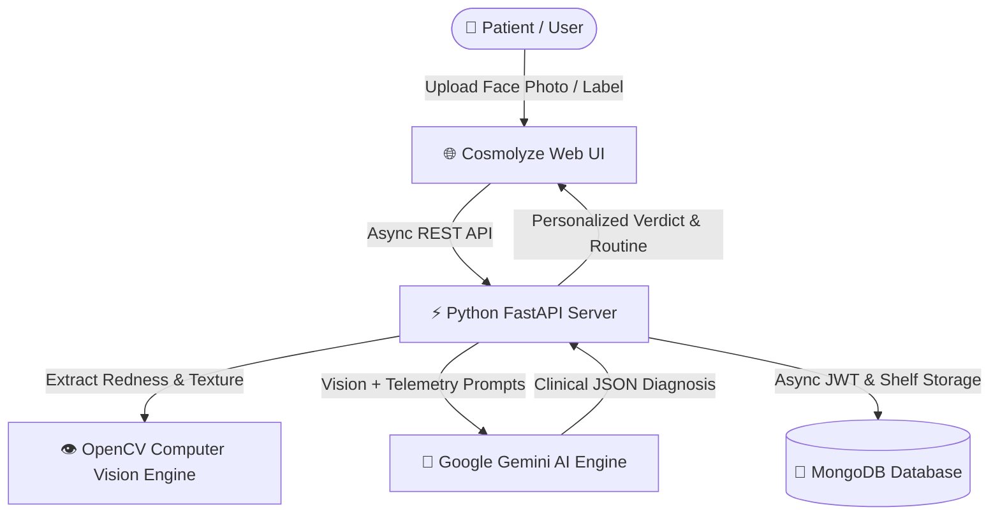

<div align="center">

# ✨ Cosmolyze — AI & Computer Vision Dermatological Platform

[](https://python.org/)
[](https://fastapi.tiangolo.com/)
[](https://opencv.org/)
[](https://ai.google.dev/)
[](https://www.mongodb.com/)
[](https://cosmolyze.onrender.com/)

**An intelligent, clinical-grade skincare & cosmetic diagnostic platform combining Computer Vision (OpenCV) and Multimodal Generative AI (Gemini) with interactive FastAPI microservices.**

[🌐 Explore Live Application](https://cosmolyze.onrender.com/) • [📚 Interactive Swagger Docs](#-api-documentation) • [✨ Key Features](#-key-features) • [🚀 Quickstart](#-getting-started)

---

</div>

## 📖 Overview

**Cosmolyze** is an end-to-end AI-powered dermatological diagnostic and cosmetic formulation platform built with **Python (FastAPI)**, **OpenCV Computer Vision**, and **Google Gemini Multimodal Vision**.

It analyzes facial skin topography, calculates objective biomarkers (erythema redness index, pore roughness, tone uniformity), diagnoses root pathologies in plain medical terms, and formulates personalized active routines and product shortlists.

---

## 🌟 Key Features

- 👁️ **Computer Vision Biomarker Extraction (`OpenCV` + `NumPy`)**
  - Extracts clinical telemetry: **Erythema / Redness Index** in LAB color space, **Texture Roughness** via Laplacian variance, and **Luminosity Uniformity**.

- 🔬 **Clinical-Grade Multimodal AI Face Diagnostic (`Google Gemini`)**
  - Identifies conditions: Acne, Hyperpigmentation, Dark Circles, Barrier Damage, Rosacea, Pores, etc.
  - Formulates two-step clinical recovery plans: Lifestyle/Habit correction + Topical home care protocols.

- 🩺 **Dynamic Diagnostic Questionnaire**
  - Generates adaptive follow-up questions based on real-time visual scan findings to isolate triggers and sensitivity.

- 🧪 **Active Ingredient & Cosmetic Formulator Verdict**
  - Matches patient pathology to target active concentrations (e.g., *Niacinamide 5%*, *Salicylic Acid 2%*, *Caffeine 3%*).
  - Formulates full morning (AM) and night (PM) product regimens within custom budget limits.

- 🔍 **Ingredient Safety & Comedogenicity Scanner**
  - Parses cosmetic formulation labels for pore-clogging comedogenic ingredients, allergens, irritants, and preservatives.

- 🧴 **Personal Digital Shelf & Daily Streak Tracker**
  - Save products, track routine consistency, manage active routines, and log skin progress over time.

- ⚡ **Interactive FastAPI OpenAPI Documentation**
  - Built-in Swagger UI (`/docs`) and ReDoc (`/redoc`) for instant API experimentation during project evaluation.

---

## 🛠️ Tech Stack

| Category | Technology |
|---|---|
| **Programming Language** | Python 3.10+ |
| **Backend Framework** | FastAPI (High-performance Async ASGI) |
| **Computer Vision** | OpenCV (`cv2`), NumPy, Pillow |
| **AI / Multimodal Engine** | Google Gemini Vision API / Generative AI SDK, Groq (Llama-3.3-70b) |
| **Database** | MongoDB with `Motor` (Async Driver) & `PyMongo` |
| **Authentication** | JWT (JSON Web Tokens) & `bcrypt` |
| **Frontend** | HTML5, CSS3, Modern JavaScript (ES6+), Tailwind CSS |
| **Deployment** | Render Cloud Platform |

---

## 🏗️ Project Architecture



---

## 📂 Repository Structure

```text
Cosmolyze/
├── cosmolyze/
│   ├── images/              # Static branding and assets
│   ├── middleware/          # JWT Auth dependencies (auth_py.py)
│   ├── models/              # Pydantic schemas (schemas.py)
│   ├── routers/             # FastAPI modular endpoints
│   │   ├── ai.py            # AI vision diagnosis & verdict routes
│   │   ├── auth.py          # User registration & login routes
│   │   ├── scan.py          # Image fetcher & scan history routes
│   │   └── shelf.py         # Digital shelf & routine bookmark routes
│   ├── services/            # Core business logic
│   │   ├── ai_service.py    # Gemini & Groq multi-provider cascade
│   │   ├── cv_analyzer.py   # OpenCV computer vision telemetry
│   │   ├── database.py      # Motor async MongoDB connector
│   │   └── prompts.py       # Clinical dermatological system prompts
│   ├── index.html           # Modern frontend single-page application
│   ├── main.py              # FastAPI main application entry
│   ├── run.py               # Development startup launcher
│   └── requirements.txt     # Python dependencies
└── README.md                # Root project documentation
```

---

## 🚀 Getting Started

Follow these steps to run Cosmolyze locally with the Python backend:

### 1️⃣ Clone the Repository
```bash
git clone https://github.com/Bhavesh-Umak/Cosmolyze.git
cd Cosmolyze/cosmolyze
```

---

### 2️⃣ Create Virtual Environment & Install Dependencies

```bash
# Create virtual environment
python -m venv venv

# Activate virtual environment (Windows)
.\venv\Scripts\activate

# Install requirements
pip install -r requirements.txt
```

---

### 3️⃣ Configure Environment Variables
Create a `.env` file in the `cosmolyze/` directory:

```env
PORT=5000
MONGODB_URI=mongodb+srv://<username>:<password>@cluster0.mongodb.net/cosmolyze?retryWrites=true&w=majority
JWT_SECRET=your_jwt_secret_key_here
GEMINI_API_KEY=your_gemini_api_key_here
GROQ_API_KEY=your_groq_api_key_here
```

---

### 4️⃣ Launch the FastAPI Server

```bash
python run.py
```

*Or via Uvicorn directly:*
```bash
uvicorn main:app --reload --port 5000
```

---

### 5️⃣ Access the Application

- **Frontend Application:** [http://localhost:5000](http://localhost:5000)
- **Interactive Swagger API Docs:** [http://localhost:5000/docs](http://localhost:5000/docs)
- **ReDoc Documentation:** [http://localhost:5000/redoc](http://localhost:5000/redoc)

---

## 📡 API Endpoints Overview

| Method | Endpoint | Description | Auth Required |
|---|---|---|:---:|
| `POST` | `/api/auth/signup` | Register new user account | ❌ |
| `POST` | `/api/auth/login` | Login user & issue JWT token | ❌ |
| `POST` | `/api/ai/analyze-face` | Run OpenCV CV metrics + Gemini AI facial diagnosis | ❌ |
| `POST` | `/api/ai/generate-verdict` | Formulate product shortlist & active routine | ❌ |
| `POST` | `/api/ai/analyze-formula` | Analyze cosmetic ingredient safety & comedogenicity | ❌ |
| `POST` | `/api/ai/search-ingredient` | Search cosmetic active ingredient library | ❌ |
| `POST` | `/api/scan/product-image` | Fetch live product bottle image via DDG | ❌ |
| `POST` | `/api/scan/save` | Save scan history & update daily streak | ✅ |
| `GET` | `/api/scan/history` | Retrieve user scan history | ✅ |
| `GET` | `/api/shelf` | Fetch user's saved skincare shelf | ✅ |
| `POST` | `/api/shelf/save` | Add or update product on shelf | ✅ |
| `DELETE`| `/api/shelf/{name}` | Remove product from shelf | ✅ |

---

## 🔒 Medical & AI Disclaimer

> **Disclaimer:** Cosmolyze uses Computer Vision and Generative AI for cosmetic skin analysis and routine planning. It is designed for educational, informational, and self-care tracking purposes and does not replace professional diagnosis, treatment, or clinical advice from a licensed dermatologist.

---

## 📄 License

This project is licensed under the **ISC License**.

---

<div align="center">
  <sub>Built with 💖 by <a href="https://github.com/Bhavesh-Umak">Bhavesh Umak</a></sub>
</div>
