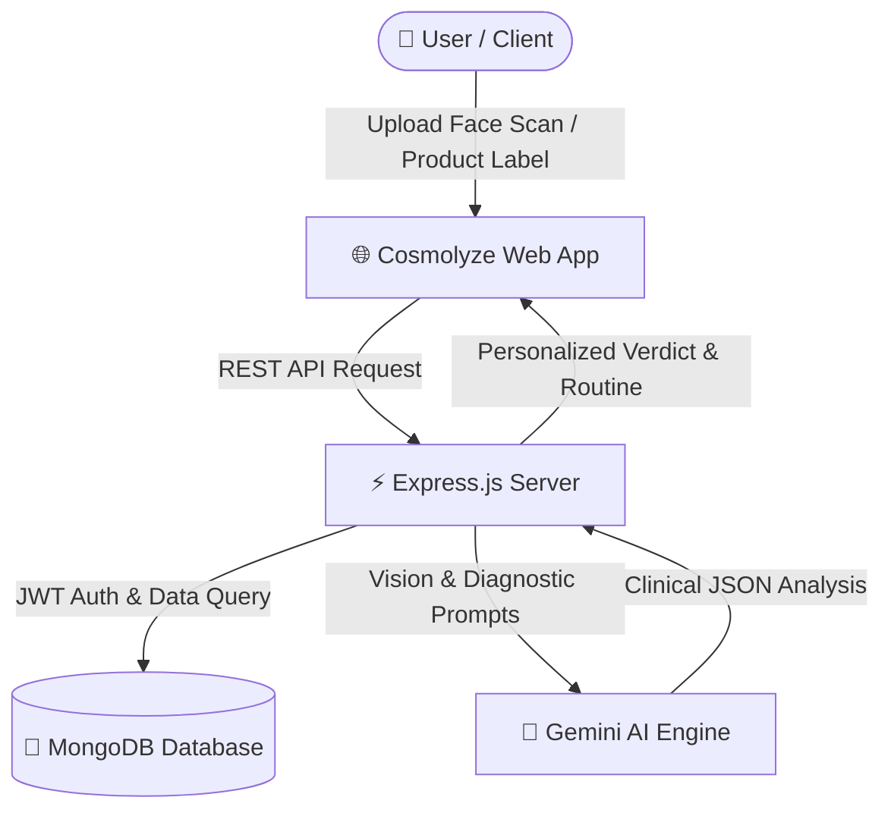

<div align="center">

# ✨ Cosmolyze — AI-Powered Cosmetic & Dermatological Analysis

[](https://cosmolyze.onrender.com/)
[](https://nodejs.org/)
[](https://expressjs.com/)
[](https://www.mongodb.com/)
[](https://ai.google.dev/)
[](LICENSE)

**An intelligent, clinical-grade skincare & cosmetic diagnostic platform that bridges the gap between dermatological science and daily skincare routines.**

[🌐 Explore Live Application](https://cosmolyze.onrender.com/) • [✨ Features](#-key-features) • [🚀 Quickstart](#-getting-started) • [📡 API Documentation](#-api-endpoints)

---

</div>

## 📖 Overview

**Cosmolyze** is an AI-driven dermatological assistant and cosmetic ingredient analyzer. By leveraging cutting-edge Vision-Language AI models with clinical diagnostic prompts, Cosmolyze provides personalized skin condition assessments, root-cause analyses, active ingredient recommendations, product ingredient compatibility checks, and digital skincare routine management.

---

## 🌟 Key Features

- 🔬 **Clinical-Grade AI Face Diagnostic**
  - Instant visual scan of skin conditions (Acne, Hyperpigmentation, Dark Circles, Barrier Damage, Rosacea, Pores, etc.).
  - Explains root causes in clear, patient-friendly medical language.
  - Multi-step recovery plans (Lifestyle corrections & Topical home care protocols).

- 🩺 **Dynamic Diagnostic Questionnaire**
  - Generates tailored dermatological follow-up questions based on the visual scan to uncover habit triggers, severity, and skin sensitivity.

- 🧪 **Active Ingredient & Product Formulator Verdict**
  - Recommends precise active ingredients and target concentrations (e.g., *Niacinamide 5%*, *Salicylic Acid 2%*, *Caffeine 3%*).
  - Formulates morning (AM) and night (PM) product regimens.

- 🔍 **Cosmetic Product & Label Scanner**
  - Analyzes ingredient lists for pore-clogging comedogenic ingredients, allergens, irritants, and skin-type compatibility.

- 🧴 **Personal Digital Shelf & Tracker**
  - Save products, track routine consistency, manage active routines, and observe skin progress over time.

- 🔐 **Secure Authentication**
  - JWT-based authentication and secure session management with MongoDB.

---

## 🛠️ Tech Stack

| Category | Technology |
|---|---|
| **Frontend** | HTML5, CSS3, Modern JavaScript (ES6+), Tailwind CSS |
| **Backend** | Node.js, Express.js |
| **Database** | MongoDB with Mongoose ODM |
| **AI / Vision Engine** | Google Gemini Vision API / AI LLM Prompts |
| **Authentication** | JWT (JSON Web Tokens) & bcryptjs |
| **Deployment** | Render Cloud Platform |

---

## 🏗️ Project Architecture



---

## 📂 Repository Structure

```text
Cosmolyze/
├── cosmolyze/
│   ├── images/              # Static assets & brand graphics
│   ├── middleware/          # Auth & request validation middleware
│   ├── models/              # Mongoose DB schemas (User, Scan, Shelf, etc.)
│   ├── routes/              # Express API Routes
│   │   ├── ai.js            # Gemini AI integration & diagnostic handler
│   │   ├── auth.js          # Authentication (Login/Register/Profile)
│   │   ├── scan.js          # Image & ingredient scanner endpoints
│   │   └── shelf.js         # User shelf & routine tracker endpoints
│   ├── prompts.js           # Clinical dermatological system prompts
│   ├── server.js            # Express server entry point
│   ├── index.html           # Main frontend SPA
│   ├── package.json         # Project dependencies & scripts
│   └── .gitignore           # Git ignore rules
└── README.md                # Project documentation
```

---

## 🚀 Getting Started

Follow these steps to set up and run the project locally on your machine.

### 1️⃣ Prerequisites
- [Node.js](https://nodejs.org/) (v18 or higher recommended)
- [MongoDB](https://www.mongodb.com/) (Local instance or MongoDB Atlas URI)
- Google Gemini API Key

---

### 2️⃣ Clone the Repository
```bash
git clone https://github.com/Bhavesh-Umak/Cosmolyze.git
cd Cosmolyze/cosmolyze
```

---

### 3️⃣ Install Dependencies
```bash
npm install
```

---

### 4️⃣ Setup Environment Variables
Create a `.env` file in the `cosmolyze/` directory:

```env
PORT=5000
MONGODB_URI=mongodb+srv://<username>:<password>@cluster0.mongodb.net/cosmolyze?retryWrites=true&w=majority
JWT_SECRET=your_jwt_secret_key_here
GEMINI_API_KEY=your_gemini_api_key_here
```

---

### 5️⃣ Run the Application

#### Development Mode (with hot reload):
```bash
npm run dev
```

#### Production Mode:
```bash
npm start
```

Open your browser and navigate to:
```
http://localhost:5000
```

---

## 📡 API Endpoints

| Method | Endpoint | Description | Auth Required |
|---|---|---|:---:|
| `POST` | `/api/auth/register` | Register a new user | ❌ |
| `POST` | `/api/auth/login` | Login user & return JWT token | ❌ |
| `GET` | `/api/auth/profile` | Get logged-in user profile | ✅ |
| `POST` | `/api/ai/analyze-face` | Run clinical AI facial diagnosis | ✅ |
| `POST` | `/api/ai/verdict` | Generate final product & active routine verdict | ✅ |
| `POST` | `/api/scan/ingredient` | Scan and evaluate product ingredients | ✅ |
| `GET` | `/api/shelf` | Fetch user's saved skincare shelf | ✅ |
| `POST` | `/api/shelf` | Add a new product to shelf | ✅ |
| `DELETE`| `/api/shelf/:id` | Remove a product from shelf | ✅ |

---

## 🔒 Security & Medical Disclaimer

> **Disclaimer:** Cosmolyze uses artificial intelligence for cosmetic skin appearance analysis and routine suggestions. It is designed for informational and self-care tracking purposes only and does not substitute professional medical diagnosis, treatment, or prescription from a board-certified dermatologist.

---

## 🤝 Contributing

Contributions, issues, and feature requests are welcome!
1. Fork the Project
2. Create your Feature Branch (`git checkout -b feature/AmazingFeature`)
3. Commit your Changes (`git commit -m 'Add some AmazingFeature'`)
4. Push to the Branch (`git push origin feature/AmazingFeature`)
5. Open a Pull Request

---

## 📄 License

This project is licensed under the **ISC License**.

---

<div align="center">
  <sub>Built with 💖 by <a href="https://github.com/Bhavesh-Umak">Bhavesh Umak</a></sub>
</div>
